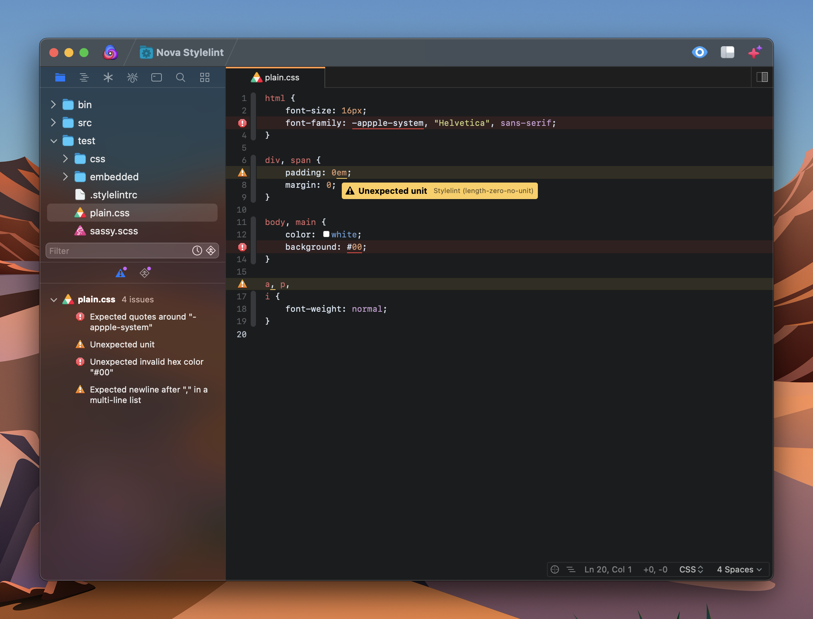

# Nova Stylelint

A [Stylelint](https://stylelint.io) extension for [Nova](https://nova.app), a new macOS-native code editor from [Panic](https://panic.com).



## Overview

This extension provides warnings on stylesheet files (CSS, SCSS, SASS, & LESS) both inline and in a sidebar summary through Nova's built-in issue/validator system.

### Requirements

If you already have Stylelint installed on your system, you're good to go!

If you don't, as long as you have an installation of Node.js and npm on your Mac that is accessible via your `$PATH` variable, you shouldn't need to install anything else.

However, if you don't have Node.js installed, the quickest way to get up and running is to install Stylelint through [Homebrew](https://brew.sh):
```
brew install stylelint
```

This will also install Node.js as a dependency of Stylelint if you don't already have it.

### Installation

Depending on which digital wormhole you traveled through to find this document, you may have already passed the `Install` button on your way down here.

Otherwise, open Nova and `Extensions > Extension Library > Search: stylelint`

### Configuration

You'll also want to have a `stylelintrc` configuration file within a project directory (or any of its parent directories, see the [Stylelint docs](https://stylelint.io) for more info).

When editing stylesheet files without an accessible `stylelintrc`, you can set the desired behavior in the extension preferences. By default an informative error notification is presented in that situation, but in the extension preferences you can silence this or fallback to linting with a preset config file if you like.

Discovery of stylelintrc config files for a given stylesheet, as well as resolution of any plugins/extends set within, should otherwise function just the same as if you were running stylelint yourself from the command line.

If you receive an error notification about Stylelint being unable to locate a specific plugin or ruleset, try installing the package globally via npm. Otherwise you can set a `config-basedir` in the extension preferences to let the extension know where to look.

## Misc

### Note

Quick confession, I'm still on my 30-day free trial of Nova and haven't actually decided whether or not I'm going to switch to it as a primary editor. Creating a plugin to fill a gap in the tools I'm used to having is definitely a good way to get a proper feel for an editor though!

### Future

* Add `fix` command.
* Figure out why stylelint caching is weird.
* Add out-of-the-box support for inline CSS in HTML, JS files

### Contribute

Always open to feedback, bug fixes, PRs, suggestions, or whatever: <br>[`nlydv/nova-stylelint`](https://github.com/nlydv/stylelint)

Feel free to also reach out to me on Twitter: <br>[`@nlydv`](https://twitter.com/nlydv)

## License

Copyright © 2022 [Neel Yadav](https://neelyadav.com)

_This project is licensed under the terms of the MIT License._ <br>_Full license text is available in the [LICENSE.md](https://github.com/nlydv/nova-stylelint/blob/master/LICENSE.md) file._
